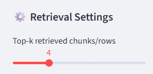

# Coversational RAG 

### Install uv package manager in the system
```
pip install uv
```

### Installation
1. Clone the Respository
```
git clone https://github.com/Rikesh-shah/RAGSDS.git
cd RAGSDS
```

2. Create and activate the environment
```
uv venv
- for windows
.venv\Scripts\activate

- for Linux
source .venv/bin/activate
```

3. Install dependencies
```
uv sync
```

### Run the project
1. For Backend
```
uvicorn backend.main:app --reload
```
2. For Frontend
```
streamlit run frontend\app.py
```


#### To adjust the number of sources top_k can be changed by sliding the slider from Retrieval setting from the sidebar
<p align="center">
  
</p>